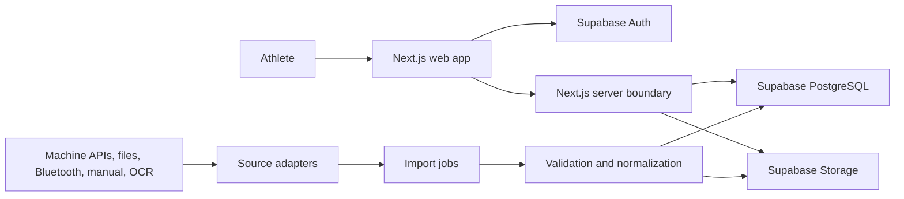
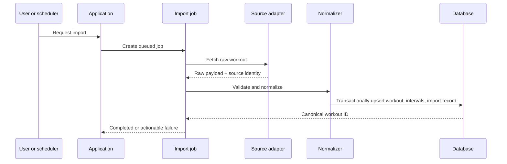

# Technical architecture

| Document field | Value |
|---|---|
| **Title** | Technical Architecture |
| **Version** | 1.0 |
| **Status** | Approved |
| **Owner** | Founders |
| **Last Reviewed** | 2026-07-21 |
| **Related Documents** | [Database Foundation](06_DATABASE.md), [Machine Providers](07_MACHINE_PROVIDERS.md), [Athlete Passport](09_ATHLETE_PASSPORT.md), [Authentication](authentication.md) |

## 1. Scope

The architecture supports a universal indoor-rowing platform centered on athlete identity, canonical workout ingestion, history, progress, events, community, and consented communications. It is not an emulation of any single machine or logbook.

The implementation now uses Supabase SSR authentication, request-scoped server clients, generated database contracts, repository-owned profile and workout access, and forward-only migrations with Row Level Security. A configured non-production Supabase project and applied migrations are required to run authenticated routes. External machine providers, live racing, billing, and full organizer operations remain later phases.

### Architectural invariants

- The architecture is provider-neutral; provider-specific behavior remains behind adapters.
- Every source maps into the canonical workout model while preserving provenance.
- Machine classes and verification tiers are explicit and independent.
- The Athlete Passport is separate from authentication, provider accounts, and event registration.
- River Expeditions and challenges reference eligible canonical workouts rather than duplicating workout truth.
- Consented communications are enforced by purpose, sender, category, and channel.
- The platform is World Rowing compatible, never dependent.

## 2. System context



Vercel hosts the Next.js application. Supabase owns authentication, relational data, and uploaded source artifacts. Long-running ingestion can later move to a dedicated worker without changing the adapter contracts.

## 3. Architectural boundaries

### Presentation

`src/app`, `src/components`, and feature presentation modules. Server Components read through server-side use cases. Client Components are reserved for interactions that require browser state.

### Application

Use cases coordinate authorization, source adapters, normalization, and persistence. Examples: `ImportWorkout`, `CreateManualWorkout`, `ListWorkoutHistory`, and `DisconnectSource`.

### Domain

Provider-neutral workout types, validation rules, metric derivation, provenance, machine classes, verification tiers, Athlete Passport claims, competition rules, River Expeditions, and consent rules. Domain code must not import Supabase, Next.js, or provider SDKs.

### Infrastructure

Supabase repositories, storage, external API clients, OCR services, and adapter implementations.

Dependencies point inward: infrastructure implements interfaces owned by the application/domain layers.

## 4. Canonical workout model

The core aggregate is a workout plus zero or more ordered intervals.

```text
Workout
  id, userId
  activityType                 # rowing today; extensible enum
  startedAt, endedAt, timezone
  durationMs, movingDurationMs
  distanceMeters
  strokeCount, averageSpm, maxSpm
  averageHeartRateBpm, maxHeartRateBpm
  averagePowerWatts, maxPowerWatts
  averagePaceMsPer500m
  caloriesKcal
  title, notes
  machineId?                   # optional user-owned physical machine
  quality, metadata
  intervals[]

WorkoutInterval
  sequence, kind
  startedOffsetMs
  durationMs, distanceMeters
  rowing metrics...
```

The database stores normalized values, while `workout_imports.raw_payload` and uploaded artifacts preserve source evidence. A source adapter may provide only a subset of metrics. Missing is represented as `NULL`, never fabricated as zero.

### Identity and deduplication

`workout_imports` records `(connection_id, external_workout_id)` when a provider has stable identifiers. A payload hash supports sources without stable IDs. Unique indexes prevent duplicate ingestion while still allowing manual workouts and multiple source accounts.

### Machine neutrality

- `source_providers` describes a connector or ingestion method.
- `source_connections` represents a user's provider account or device pairing.
- `machines` represents a physical machine known to the user.
- `machine_models` contains optional catalog metadata keyed by manufacturer and model.

No canonical workout foreign key points to a Concept2-specific table.

## 5. Pluggable source contract

Adapters should implement an interface equivalent to:

```ts
export interface WorkoutSourceAdapter {
  readonly providerKey: string;
  connect?(input: ConnectInput): Promise<ConnectionResult>;
  list(input: ListSourceWorkoutsInput): Promise<SourceWorkoutReference[]>;
  fetch(input: FetchSourceWorkoutInput): Promise<RawSourceWorkout>;
  normalize(input: RawSourceWorkout): Promise<CanonicalWorkoutDraft>;
}
```

Manual entry can normalize a submitted form directly. OCR/photo upload stores the original image, runs extraction, and returns a draft requiring user confirmation. Bluetooth may stream a session into a draft before committing it. Provider adapters own translation; they do not own persistence.

## 6. Import pipeline



Job processing is idempotent. State transitions are `queued -> processing -> completed` or `failed/cancelled`. Retries increment `attempt_count`, preserve the last error, and never create duplicate canonical workouts.

## 7. Data ownership and security

- User-owned rows carry `user_id` and are protected by RLS using `auth.uid()`.
- Provider catalog rows are globally readable but writable only by privileged migrations/admin processes.
- Storage paths begin with the user's UUID, and bucket policies must enforce that ownership.
- OAuth refresh/access tokens are not stored in plain relational columns. Store an opaque secret reference and keep secrets in a server-side vault.
- The service-role key is restricted to server/worker environments.
- Authorization is checked at both the application boundary and database policy layer.

### Account, Profile, and Passport

`auth.users` owns credentials and session identity. `profiles` is the private, one-per-user account-linked athlete record. `athlete_passports` is the athlete-facing presentation and claim container; `profile_visibility_settings` controls granular publication. A secure, idempotent `handle_new_user` trigger creates the Profile, Passport, private visibility defaults, and athlete role. Client code never supplies an ownership ID.

Public surfaces query deliberately restricted projections (`public_athlete_passports`, `public_ranking_results`, and `public_club_summaries`) rather than private tables. Roles live in `user_roles` and cannot be granted by editing a profile.

### Repository boundary

Visual components do not create Supabase clients or issue direct ownership queries. Server-only repositories under `src/server/repositories` obtain the authenticated user, rely on RLS, and map generated database rows into UI/domain contracts. Browser clients are limited to session-aware interactions such as configured OAuth and password recovery.

## 8. Server/API strategy

- Server Components: authenticated reads where streaming and caching behavior are explicit.
- Server Actions: narrow first-party mutations with schema validation and revalidation.
- Route Handlers: OAuth callbacks, webhooks, uploads, and integration endpoints.
- Background worker/Edge Function: imports that may outlive a request.

Every mutation validates input (for example with Zod), derives `user_id` from the authenticated session, and returns typed domain errors. Never accept a caller-supplied owner ID.

## 9. Suggested source tree

```text
src/
  app/
    (public)/
    (auth)/
    (app)/
    auth/callback/
    api/integrations/[provider]/
    api/webhooks/[provider]/
  components/
    ui/
    shared/
  features/
    auth/
    workouts/
    imports/
    sources/
    machines/
    profile/
  lib/
    env/
    validation/
    supabase/
  server/
    application/
    domain/
    infrastructure/
      adapters/
      repositories/
  types/
```

Each feature should expose a small public API. Vendor packages belong under `server/infrastructure/adapters/<provider-key>`.

## 10. Operational concerns

- Structured logs include job ID, provider key, and canonical workout ID, but not tokens or raw health data.
- Import job latency, failures, retries, duplicate rate, and normalization warnings are observable metrics.
- Database migrations are forward-only and reviewed in CI.
- Preview deployments use a non-production Supabase project or branching strategy.
- Backups and point-in-time recovery should be enabled before production use.

## 11. Implementation sequence

1. Configure Supabase clients, request-scoped authentication, and generated database types.
2. Reconcile and apply the schema with automated RLS and authorization tests.
3. Implement manual entry through the same canonical application boundary used by adapters.
4. Add history, detail, provenance, and personal-record reads.
5. Add photo/OCR draft confirmation.
6. Add the provider adapter framework and first external integration based on demand and access.
7. Add Athlete Passport, consent, event discovery, and community domains in the order defined by [13_ROADMAP.md](13_ROADMAP.md).

## 12. Architecture decisions to record next

Create ADRs when choosing the job runner, OCR provider, first external integration, token vault, and analytics/observability stack. These are deliberately deferred so the MVP foundation does not prematurely couple itself to a vendor.

## 13. Prototype-data transition

- **Replace now:** signed-in identity, location, settings, Passport presentation, and athlete-owned workout history come from Supabase through server repositories.
- **Retain as reference catalogues:** ISO countries, machine-provider/model definitions, competition taxonomy, and the Expedition catalogue remain typed product reference data until migrated into production-safe seeds.
- **Retain temporarily:** controlled ranking and Event fixtures may demonstrate taxonomy, but they must never become the signed-in athlete's identity or bypass record ownership.
- **Remove from runtime ownership:** browser-session and hardcoded prototype athlete records are not authoritative. No production authentication user is seeded.

This classification keeps visual prototypes usable while maintaining one credential-to-Profile-to-Passport identity chain.
